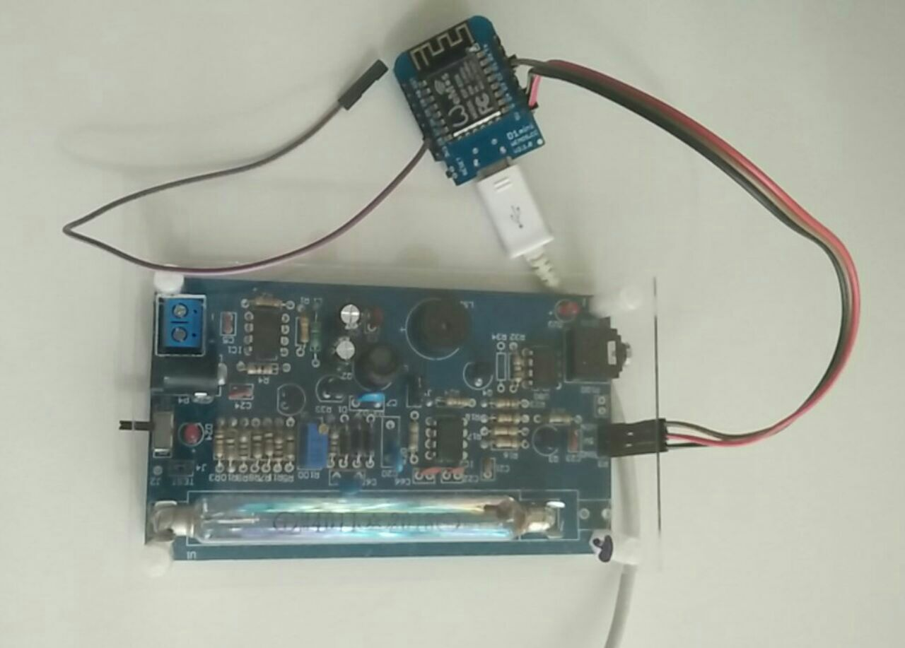
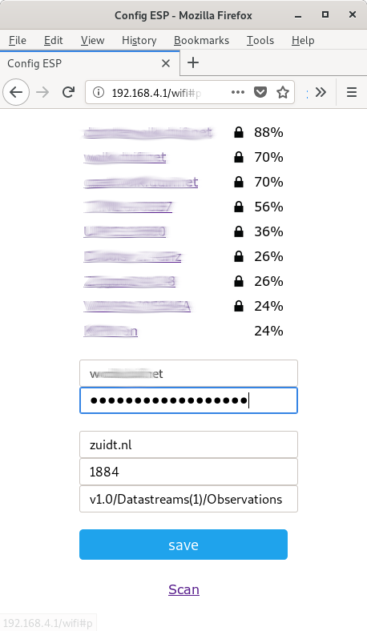

# Arduino sketch for use with Wemos ESP8266

Sent CPM counts fo a Frost server from cpm-tube board connected to Wemos D1 mini

Counting code based on Revspace version: https://github.com/revspace/geiger (creds for Revspace coders)

There is A LOT of information in the code comments, please check there.

TIPS:

- to flash to ESP8266, make sure you flash with "Tools/Flash Size/4M (1M SPIFFS)" as we use the FS/filesystem
- to 'silence' the board: just remove the little J1 jumper next to the buzzer

## Features

- using WifiManager to configure wifi params
- using WifiManager to configure mqtt/Frost params
- saves config to filesystem on ESP8266
- can be RE-configured by pull up D8 (shortly connect D8 and 3V)
- sends cpm as json to Frost MQTT server

Simple connection setup:

```
Board GND -> Wemos G
Board 5V  -> Wemos 5V
Board VIN -> Wemos D2 (in current sketch setup, check code)

To reset params: connect Wemos D8 with Wemos 3V
```



## LEDS

Wemos (blue) led blinking: you need to configure wifi/mqtt

Wemos (blue) let off: all OK

Wemos (blue) constantly on: mqtt problems, please (re) configuare

## Configuration

Configuration via the Wifi configuration page:

- connect to the GEIGER-CONFIG-ME-192-168-4-1 wifi network (created by Wemos)
- go to 192.168.4.1 on that network in your browser
- fill in all info on that page (example below)
- save and check



## Frost configs

You need the following:

- 'mqtt host', for example 'zuidt.nl'
- 'mqtt port', for example '1884' for Frost server there
- 'mqtt topic' to send the Frost message to: eg: 'v1.0/Datastreams(0)/Observations'

To check: use mosquitto_sub to subscribe to messages:
```
mosquitto_sub -v -h zuidt.nl -p 1884 -t "v1.0/#"
```
